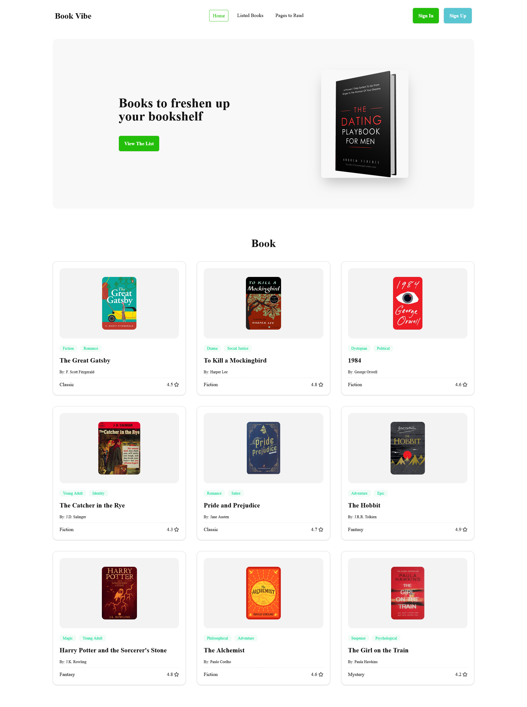
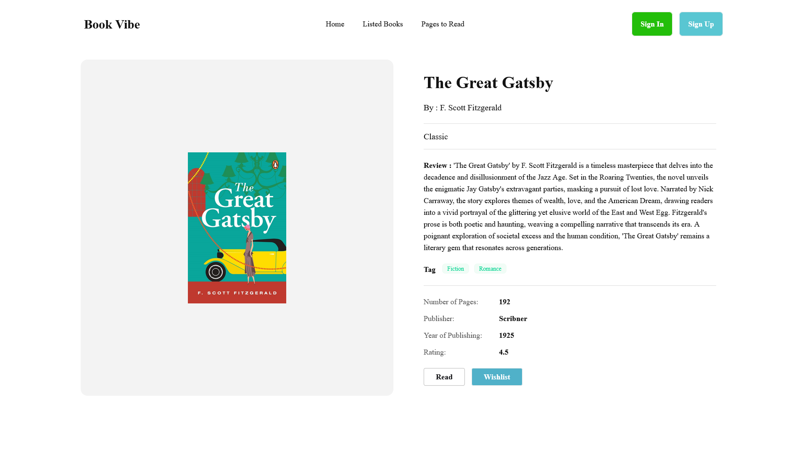
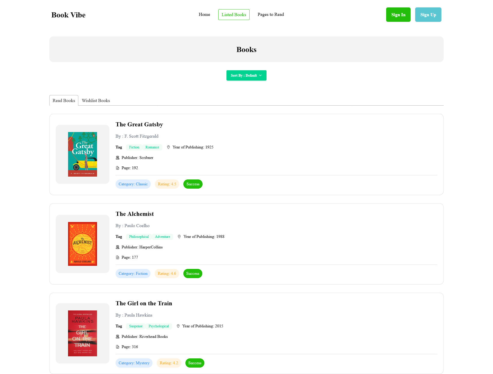
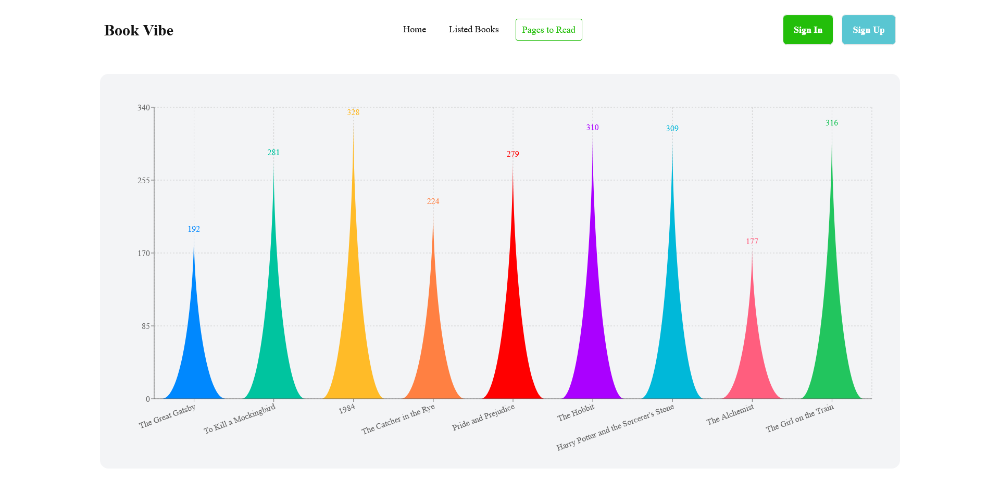

# 📘 Book Vibe

Book Vibe is a modern React-based web application that helps users explore books, view details, and manage reading preferences.  
It provides a clean UI where users can browse books, see detailed information, and keep track of selected books.

---

## 📸 Preview



---

## 🚀 Live Demo

🔗 Live Website: https://book-viibe.netlify.app/  
🔗 GitHub Repository: https://github.com/nafiz2024/Book-Vibe

---

## ✨ Features

- 📚 Browse book collection
- 🔍 View detailed book information
- ❤️ Add books to reading list
- 📊 Display selected books summary
- ⚡ Fast performance with React
- 🎨 Clean UI using Tailwind CSS
- 📱 Fully responsive design
- 🔄 Dynamic data rendering

---

## 🧠 How It Works

1. React app loads book data from JSON file.
2. Books are displayed in card format.
3. User can click a book to view details.
4. Selected books are stored in state.
5. UI updates automatically when user interacts.

---

## 🛠️ Technologies Used

### Frontend
- React.js
- JavaScript (ES6+)
- Tailwind CSS
- React Router

### Data
- JSON

---

## 📦 Installation

Clone the repository:

```bash
git clone https://github.com/nafiz2024/Book-Vibe.git
```

Go to project folder:

```bash
cd Book-Vibe
```

Install dependencies:

```bash
npm install
```

Run the project:

```bash
npm run dev
```

Build for production:

```bash
npm run build
```

---

## 📂 Project Structure

```
Book-Vibe
│
├── public
│
├── src
│   │
│   ├── components
│   │   ├── Navbar.jsx
│   │   ├── BookCard.jsx
│   │   ├── BookDetails.jsx
│   │   ├── ReadingList.jsx
│   │   └── Wishlist.jsx
│   │
│   ├── pages
│   │   ├── Home.jsx
│   │   ├── ListedBooks.jsx
│   │   └── BookDetailsPage.jsx
│   │
│   ├── data
│   │   └── booksData.json
│   │
│   ├── assets
│   │   └── images
│   │
│   ├── routes
│   │   └── Router.jsx
│   │
│   ├── App.jsx
│   ├── main.jsx
│   └── index.css
│
├── package.json
├── vite.config.js
├── tailwind.config.js
└── README.md
```

---

## 📸 Screenshots

### Home Page


### Book Details



### Reading List



### Page To Read



---

## 🔮 Future Improvements

- Search books feature
- Category filter
- User authentication
- Backend database integration
- Dark mode
- Book rating system

---

## 👨‍💻 Author

**Nafiz Alam**  
Frontend Web Developer | MERN Stack Developer  

- 🌐 GitHub: https://github.com/nafiz2024  
- 💼 LinkedIn: https://www.linkedin.com/in/nafiz-alam04/  
- 📧 Email: nafizalam.dev@email.com  

---

## ⭐ Support

If you like this project, give it a star on GitHub ⭐